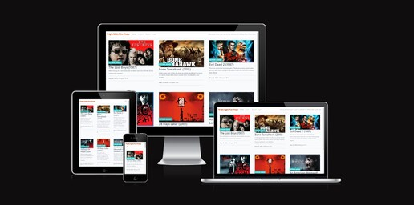
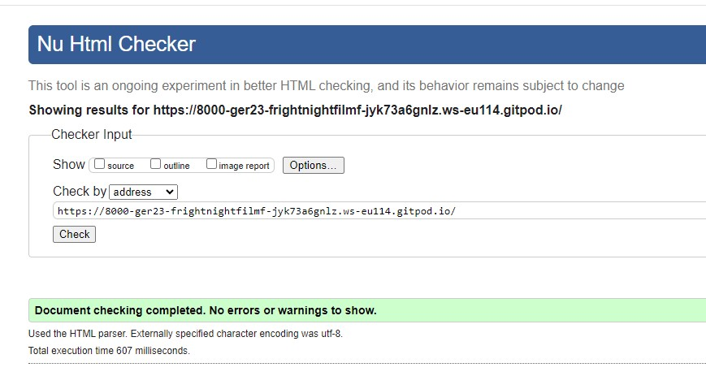
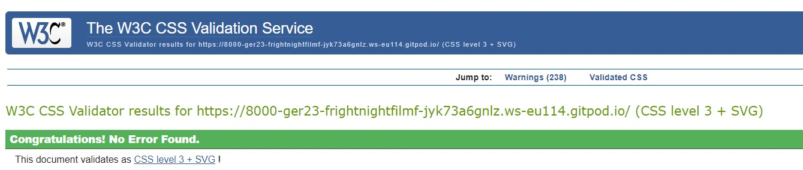
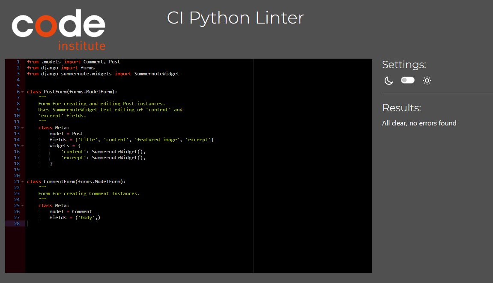
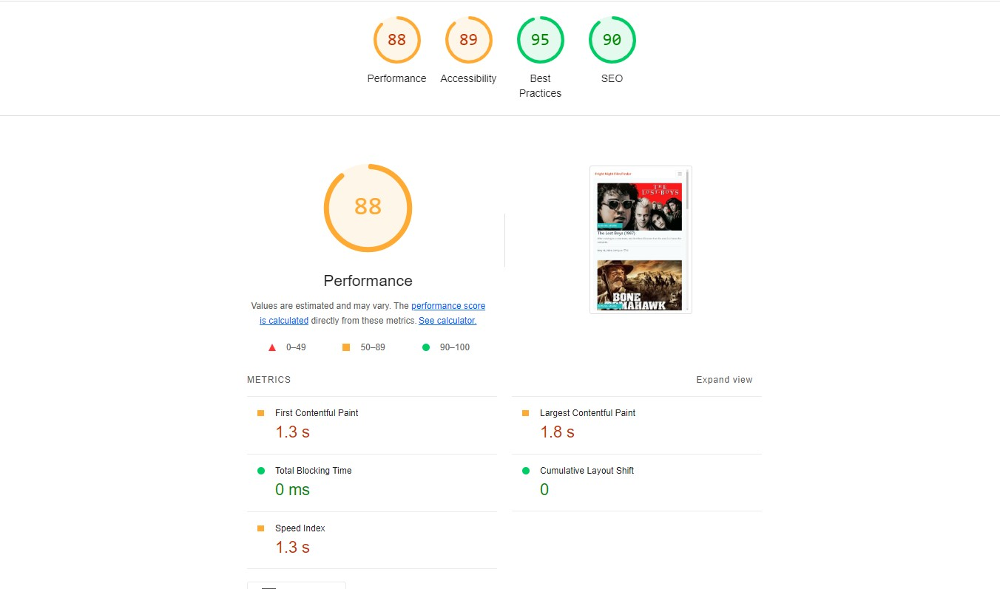

# Fright Night Film Finder

This is my fourth milestone project with Code Institute. It is a website for people who enjoy horror movies to seek a recommendation for a movie, comment on, like and/or review other peoples movie posts, or indeed post their own recommendations.

[Click here to go to my live project](https://fnff-app-762333af5e41.herokuapp.com/)

## Project Goal

The primary goal for this project is to create a horror movie website that enables full CRUD functionality to admin users so that they can Create, Read, Update, Delete, as well as like posts directly on the site, and for registered users the ability to Create comments, Read comments and posts and like posts if they wish. The admin user has full control over their posts and any changes made are reflected on the site.

## Approach

An Agile methodology was used to plan this project. This was implemented using a Kanban board in GitHub Project with linked Issues. To cover the goals of this project, a total of 10 User Stories where created. Labels where then used to prioritize the importance of each User Story.

The following labels were used in this project and the distribution of user stories by label are:

Must-Have: 6/10
Should-Have: 2/10
Could-Have: 2/10

For more info: [View Kanban Board here.](https://github.com/users/Ger-23/projects/7)

## Features

## Design

## Testing

### Browser Testing

I have tested that this application works using the following browsers:

  - Safari Version
  - Google Chrome
  - Microsoft Edge

I have tested this application works on the following devices:

  - Samsung S22
  - iPad 10

### Responsiveness

Chrome developer tool have been used to check the responsiveness.

I have tested that this application works on different screen sizes from small (260px wide) to standard screen size (1920px wide).

### Validator Testing

**W3C Markup Validator**

The W3C Markup Validator was used to validate the HTML on all pages of the project to ensure there were no errors. 
All passed without errors.

**W3C CSS Validator**

The W3C CSS Validator was used to validate the CSS in the project to ensure there were no errors. 
All passed without errors.

**The CI Python Linter**

The Code Institute Python Linter was used to ensure there were no errors in the Python code. 
All passed without errors.

**Lighthouse Validation**

The Lighthouse Extension in Google Chrome was used to check performance, accessibility best practices 
and search engine optimisation. 

## Deployment

## Future Implementation

  - Complete Readme.
  - Create more tests on views, models and forms.
  - Improve lighthouse performance scores
  - Create images functionality for Team member profiles.
  - Give registered users edit functionality for comments.

## Bugs

- Issue loading images to assets folder from local. Having to delete cookies
and site data each time for any results but still not loading all images 
(eg. Python Linter images for views and models, testing on views, models and forms, etc.)

## Credit

- I Think Therefore I Blog Walkthrough for code and structure
- Mentor & Code Institute Tutors for guidance and coding assistance.
- Fishtails project for Readme guidance
- Stack Overflow for code assistance.